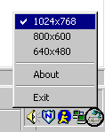

## Change Screen Resolutions

### Description

An App that sits in the taskbar...you right click on it to chagne resolutions.
 
### More Info
 

             |
---                |---
**Submitted On**   |2000-03-13 18:33:30
**By**             |[Justin Hinerman](https://github.com/Planet-Source-Code/PSCIndex/blob/master/ByAuthor/justin-hinerman.md)
**Level**          |Intermediate
**User Rating**    |4.7 (14 globes from 3 users)
**Compatibility**  |VB 5\.0, VB 6\.0
**Category**       |[Complete Applications](https://github.com/Planet-Source-Code/PSCIndex/blob/master/ByCategory/complete-applications__1-27.md)
**World**          |[Visual Basic](https://github.com/Planet-Source-Code/PSCIndex/blob/master/ByWorld/visual-basic.md)
**Archive File**   |[CODE\_UPLOAD39733132000\.zip](https://github.com/Planet-Source-Code/justin-hinerman-change-screen-resolutions__1-6574/archive/master.zip)

